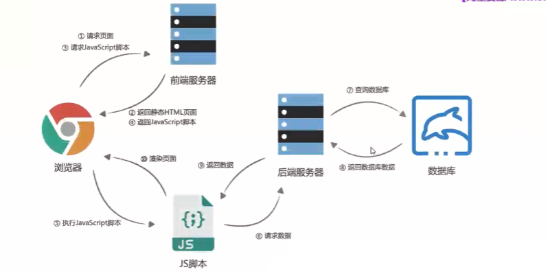
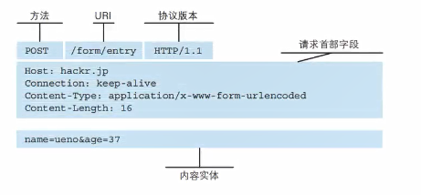

# 前后端分离的优势

早期的网页都是通过后端渲染来完成的: **服务器端渲染**.

服务器端渲染显示动态数据的原理为: 当刷新页面的时候, 后端会从服务器中查找到数据, 然后将查询到的数据放入HTML中, 而这个HTML的组装的过程, 是由服务器来完成的( 早期网页开发模式 ).

即: 客户端发出请求->服务端接受请求并返回相应的HTML文档->页面刷新, 客户端加载新的HTML文档, 这个方式有很多缺点, 因为很多时候页面本质上知识一些数据发生了变化, 但是服务器却要重新绘制整个页面在返回给浏览器加载, 这会给网络带宽带来不必要的开销.

前后端分离: **前端做前端的事情, 后端做后端的事情**, 开发中只有一个基本的HTML结构, 然后使用JavaScript调用一些api (例如xhr/fetch) 向api服务器发送请求, 然后服务器查询数据, 并将数据返回给前端, 然后动态创建HTML元素并且将内容渲染进去, 这种开发模式下, 是在客户端组装和渲染 (**客户端渲染**).

即: 页面数据变动时, 只向服务器请求新的数据, 并且在阻止页面刷新的情况下, 动态替换页面中展示的数据(AJAX: 异步的JavaScript和XML).

AJAX最吸引人的就是它的"异步"特性, 也就是说它可以在不重新刷新页面的情况下与**服务器通信, 交换数据, 或者更新页面**.

可以使用AJAX的特性来做下列事情:

1. 在不重新加载页面的情况下发送请求给服务器;
2. 接收并使用从服务器发来的数据;

# 什么是HTTP?

什么是HTTP呢?

1. 超文本传输协议: 是一种用**于分布式, 协作式和超媒体信息系统的应用层协议**;
2. 是万维网的数据通信的基础, 设置HTTP的最初的目的是为了**提供一种发布和接收HTML页面的方法**;
3. 通过HTTP或者HTTPS协议请求的资源由统一资源标识符来标识.

HTTP是客户端和服务端之间请求和相应的标准:

1. 同各国使用晚会也浏览器, 网页爬虫或者其它工具, 客户端发起一个HTTP请求到服务器上的指定端口, 我们称这个客户端为**用户代理程序**.
2. 响应的服务器上存储着一些资源, 比如HTML文件和图像, 我们称这个响应服务器为**资源服务器**.

 

## HTTP的组成

一次HTTP请求主要包括: 请求(request)和响应(response).

下面是一次请求里的所有内容:

其中, 方法, URL, 协议版本所在的一行被叫做请求行, 请求的首部字段叫做请求头, 内容		实体为请求体

下面是一次相应信息内部的内容:

​				

## HTTP的版本

- **HTTP0.9** 

1. 发布于1991年.
2. 支支持GET请求方法获取文本数据, 主要目的是获取HTML页面内容.

- **HTTP1.0**

1. 发布于1996年.
2. 支持POST, HEAD等请求方法, 支持请求头, 响应头, 支持更多数据类型.
3. 但是浏览器每次请求都需要与服务器建立一个TCP连接, 请求处理完成后立即断开TCP连接, 每次建立连接增加了性能损耗.

- **HTTP1.1**(目前使用的最广泛的版本)

 	1. 发布于1997年.
 	2. 增加了PUT, DELETE等方法.
 	3. 采用了**持久连接**, 多个请求可以共用同一个TCP连接.

- **HTTP2.0**

1. 发布于2015年.

- **HTTP3.0**

1. 发布于2018年.

## HTTP请求方式

1. **GET**: GET请求一个指定资源的表示形式, 使用GET的请求应该只被用于获取数据.
2. HEAD: HEAD请求一个与GET请求的相应相同的响应, 但是没有响应体, 比如准备下载一个文件前, 先获取文件的大小, 再决定是否进行下载.
3. **POST**: POST方法用于将实体提交到指定的资源.
4. PUT: 这个返回发请求有效载荷替换目标资源的所有当前表示.
5. DELETE: 这个方法用来删除指定的资源.
6. PATCH: 这个方法用于对资源部分进行修改.
7. CONNECT: 这个方法用来建立一个到目标标识的服务器的隧道, 通常用在代理服务器, 网页开发很少用到.
8. TRACE: 这个方法沿着到目标资源的路径执行一个消息环回测试.

## HTTP Requset Header

在request对象的header中也包含很多有用的信息. 客户端会默认传递过来一些信息.

其中有一些比较重要的:

- **content-type**, 这个属性表示本次请求携带的数据的类型(最重要).

1. application/x-www-form-urlencoded: 表示数据被编码成以"&"分隔的键值对, 同时以"="分隔键和值(比较常见).

2. application/json: 表示是一个json类型.
3. text/plain: 表示是文本类型.
4. application/xml: 表示是xml类型.
5. multiparty/form-data: 表示是上传文件(用来做文件上传).

- **content-length**, 文件的长度, 这个会自动计算, 不需要手写.
- **keep-alive**, 已知http是基于TCP协议的, 但是通常在印象一次请求和想要后会立刻中断, 在http1.0后, 如果想要继续保持连接, 浏览器需要在请求头中添加connection: keep-alive; 服务器也需要在响应头中添加, 这样当客户端再次请求的时候, 就会使用同一个连接, 可以减少性能损耗,.在http1.1中. 所有的链接默认是保持keep-alive. (也不需要手动设置)
- **accept-encoding**: 告知服务器, 客户端支持的文件压缩格式, 比如js文件可以使用gzip编码, 对应.gz文件 (浏览器会自动解压的, 可以在部署的时候放好gz文件).

## HTTP Response响应状态码

HTTP状态码, 是用来表示HTTP响应状态的数字代码:

http状态码非常多, 可以根据不同的情况, 给客户端返回不同的状态码.

最常用的几种:

| 常见的状态码 | 状态描述              | 信息说明                                             |
| ------------ | --------------------- | ---------------------------------------------------- |
| **200**      | OK                    | 客户端请求成功                                       |
| **201**      | Created               | Post请求, 创建新的资源(也表示成功)                   |
| 301          | Moved Permanently     | 请求的资源的URL已经修改响应中会给出新的URL           |
| 400          | Bad Request           | 客户端的错误, 服务器无法或者不进行处理               |
| 401          | Unauthonrized         | 未授权的错误, 必须携带请求的身份信息                 |
| 403          | Forbidden             | 客户端没有权限访问, 被拒绝                           |
| 404          | Not Found             | 服务器找不到请求的资源                               |
| 500          | Internal Server Error | 服务器遇到了不知道如何处理的情况                     |
| 503          | Service Unavailable   | 服务器不可用, 可能处理维护或者重载状态, 暂时无法访问 |

